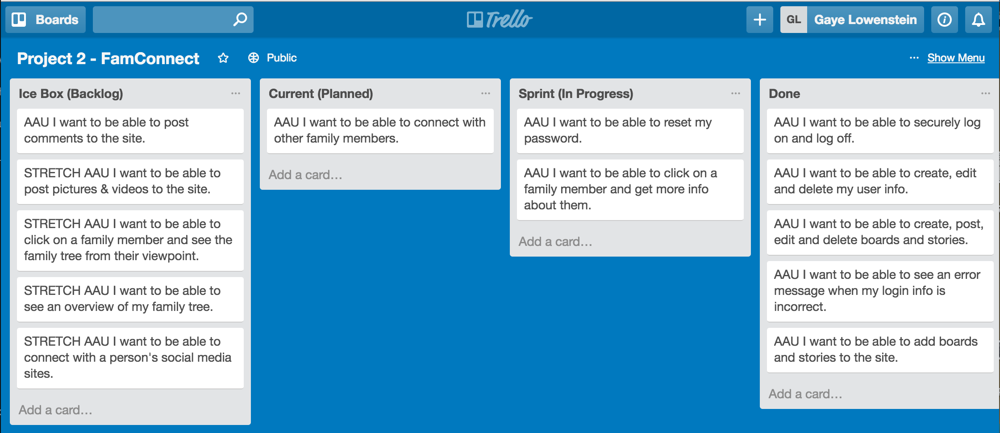
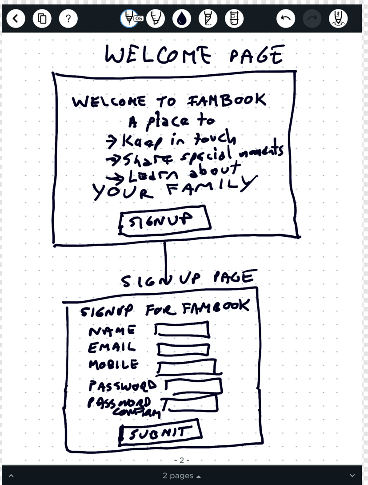
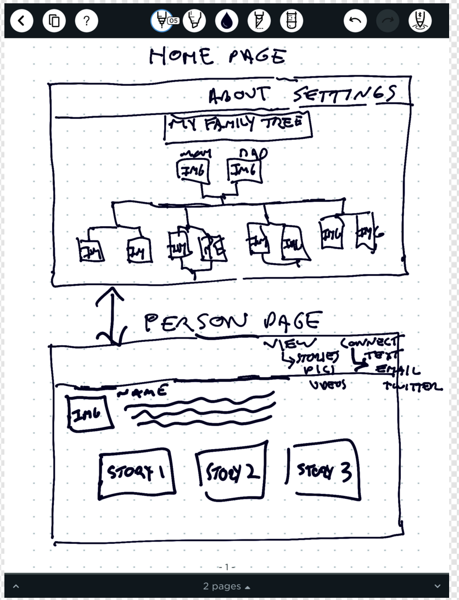
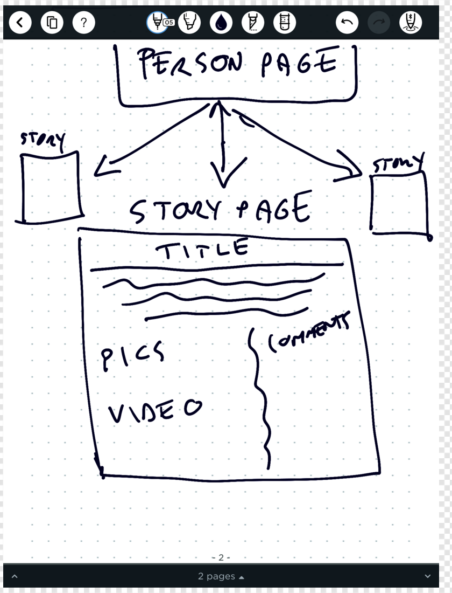
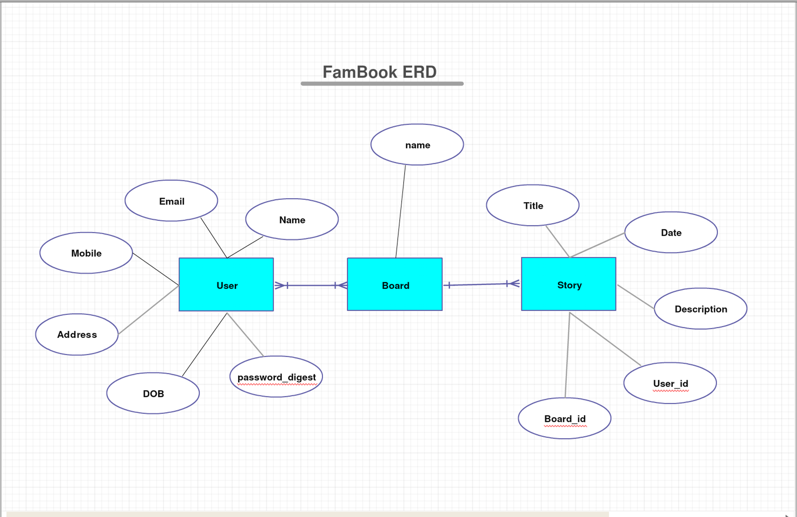

# Project 2 - FamBook

FamBook will be a website for families to:

* Connect with family
* Learn about family
* Find out about upcoming events

### Approach

FamBook was created with Ruby on Rails and Postgresql using the MVC (Model-View-Controller) architecture.

After generating a model in the rails console, the following steps were taken:

1. Confirm the migration data was correct
2. Create the routes
3. Code the model data
4. Code the controller data
5. Code the view data

The project consisted of coding an MVC for the User, Board and Story models. At each step a new Git Branch was created and tested in the browser.

After each modification, the changes were added, committed and pushed up to Github.
At the end of each day, the updated Github version was deployed using Heroku.

### MVP

* The user will be able to securely create a new account and login.
* The user will be able to create a secure password.  
* The user will be able to create, read, update and destroy their user account, boards and stories. (full CRUD functionality)

### Technologies Used

- HTML
- SCSS
- Bootstrap
- Ruby on Rails
- PostgreSQL
- Active Record
- Git
- Github
- Heroku

### Installation Instructions

1. Go to [Github Project Page - https://github.com/glowen18/project_2_fambook1](https://github.com/glowen18/project_2_fambook1)
2. Click on this [Online Link to FamBook - https://fambookapp.herokuapp.com/](https://fambookapp.herokuapp.com/)
3. Create a FamBook Page and Enjoy!

### Unsolved Problems

1. Password reset does not connect to user's email.
2. Need to create error message if email already in use.
3. Need to create error message if password is not long enough.
4. Ability to upload photos and videos to the site.
5. Ability for users to post comments on the site.
6. Ability to connect via email or social media on the site.

##Trello
[Trello User Stories](https://trello.com/b/059r2syb/project-2-famconnect)

##Wire Frames

##ERD Models  

